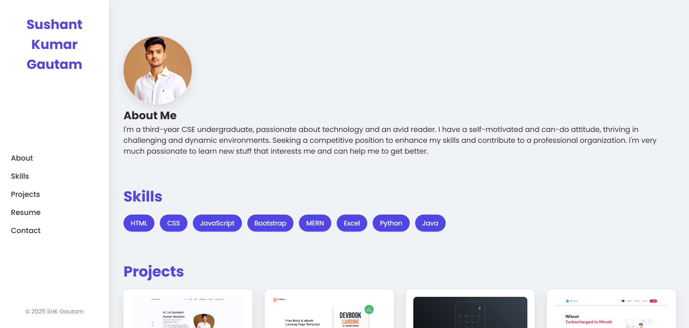
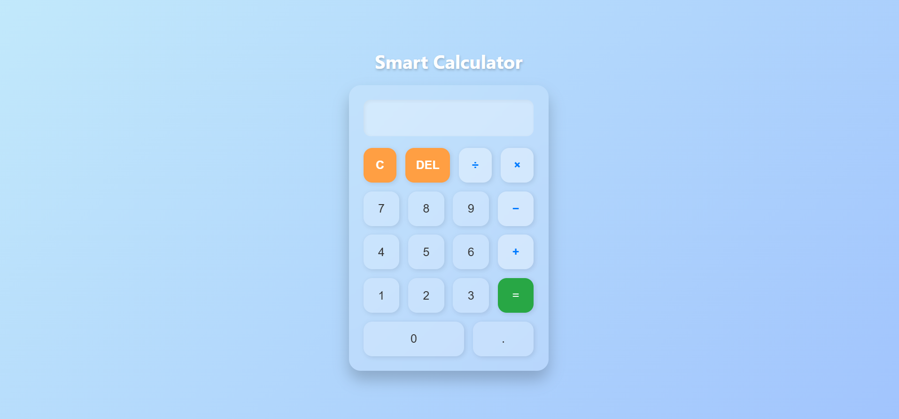

# CODSOFT Taskd

At CodSoft, interns are assigned real-world projects to enhance their practical skills. Each task is designed to develop hands-on experience in coding, problem-solving, and project development. Tasks are categorized by difficulty and must be submitted within the given deadline, including proper documentation and GitHub uploads.
The tasks mainly involve front-end technologies such as HTML, CSS, and JavaScript, helping interns build responsive and interactive user interfaces. These technologies form the foundation for modern web development and are essential for creating real-time, user-friendly websites and applications

---

## 🛠️ Task 01 – Portfolio Website
Creating a personal portfolio using CSS and HTML is a popular beginner web development project.

## 🛠️ Task 02 – Landing Page Website
A landing page is an ideal web development project for beginners. It requires basic
knowledge of HTML and CSS. Through this project, you'll learn to create columns, divide
sections, arrange items, and add headers and footers. The most important aspect is
unleashing your creativity to design an impressive page. Pay attention to alignments,
padding, color palette, boxes, and other elements. Be mindful of CSS to avoid overlapping
elements. In short, a landing page project allows you to apply HTML and CSS skills,
encouraging your creativity while ensuring a visually appealing and user-friendly design.

## 🛠️ Task 03 – Calculator
To create a basic calculator using CSS, HTML, and JavaScript, you'll need to implement an
interactive interface with buttons for addition, subtraction, multiplication, and division
operations. The calculator should have a display screen to show user input and results. Utilize
CSS grid system for button alignments. Use event listeners, if-else statements, operators, and
loops to handle user input and perform calculations. This project requires some skill but can be
done with basic knowledge of these technologies..

